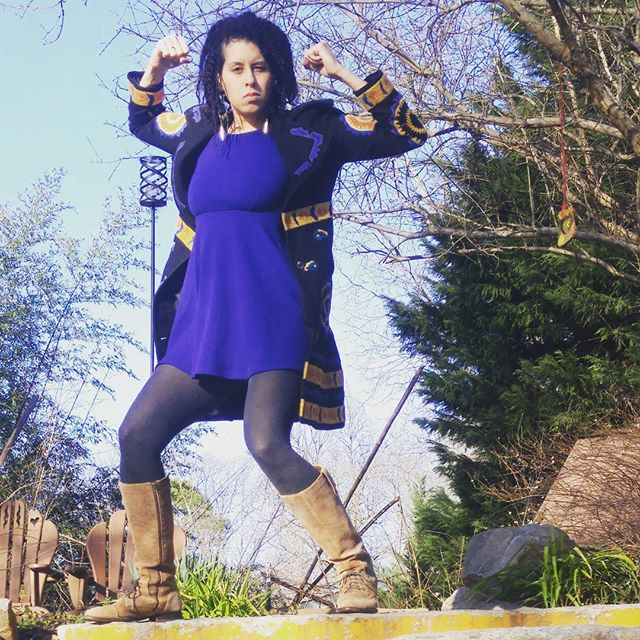
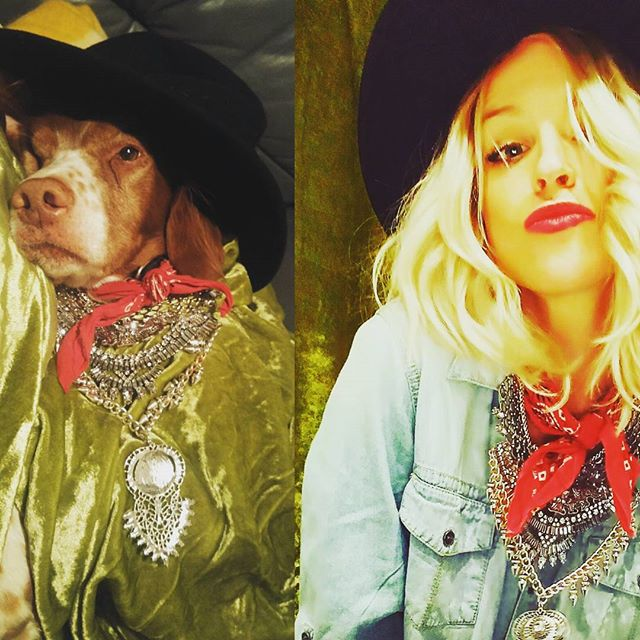

<!-- Twitter icon from https://github.com/carlsednaoui/gitsocial -->
[1.1]: http://i.imgur.com/tXSoThF.png (twitter icon with padding)

# _Gunstreet Goods_

#### _Mock-up E-commerce Site_
_UI - Week 3: SASS_
_UI - Week 2: Web Design Process_

#### **Dawn Mott** :sunrise_over_mountains: _June 7th, 2018_

## Description

_Mock e-commerce site for [GunStreet Goods](https://www.facebook.com/Gunstreet-Goods-967820216586146/)_

 

## Specs
_Check out info.md for additional planning information_

 

## Setup/Installation Requirements
* Clone this repository
* Buy some awesome vintage
* Wear said vintage

## Known Bugs

_There are many known :bug: at this time, this is a work in progress_

## Support and contact details

_If you'd like to chat, please contact_ @dawnrparty _on_ ![alt text][1.1]

## Technologies Used

_HTML, CSS, and flattery_

### License

*This page is licensed under the MIT license*

&copy; 2018 **Dawn Mott** :sunrise_over_mountains:
